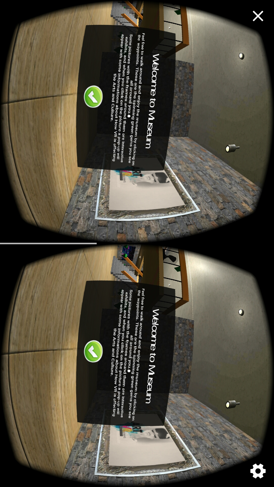

### NightofMuseum

Night of Museum was created as a part of Udacity’s VR nanodegree program. We were  required to research on a VR company/technology, or an industry that could be impacted by VR. After conducting our research, we decided to create a mobile virtual reality app with 'information booths' which include both visual and audio feedback for users that present the impact of VR in the  Art and culture industry. Here is a brief review of the experience.

### Features
* More than 1 intractable item
* Semi realistic environment
* Calm background music (from https://www.bensound.com)
* Some basic knowledge and information

### Software/ Plugins Used
* Unity Engine 2017.1.0p4
* Google VR SDK 1.60

### DEMO Video Link
Video : https://youtu.be/_X-jkzCpL-I

### More Information
not yet available (check back soon)

More information about the course at: https://classroom.udacity.com/nanodegrees/nd017
